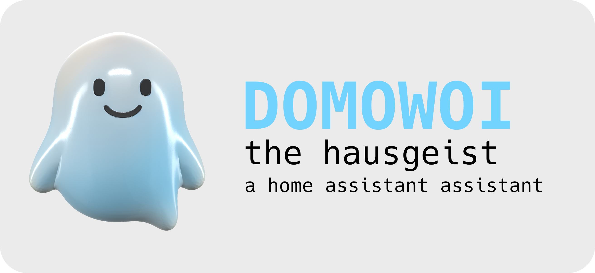
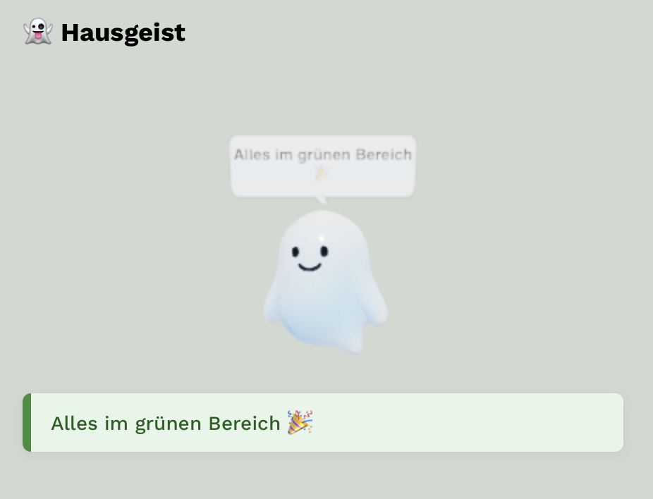

# Domowoi

A friendly ghost who watches over your home and tries to help you.

# Hausgeist Card

An intelligent, multilingual Home Assistant Lovelace card for indoor climate, energy, and comfort suggestions.

## Features
- Flexible, configurable rules (`src/rules.json`)
- Multilingual support (de/en)
- Automatic evaluation of all sensors in the selected area, robust detection (multilingual, device_class and name)
- Shows the most important suggestions for all rooms/areas (not just one)
- Debug mode: shows all evaluated rules per room (toggleable in the editor)
- Visual editor for Home Assistant (Lovelace UI)
- Modern, customizable design (uses Home Assistant theme variables)

## Screenshots

## Installation
### Via HACS
1. Install HACS in your Home Assistant instance if you haven't already.
2. In HACS, go to "Frontend" and click on the "+" button to add a new resource.
3. Add the repository `strhwste/Domowoi`.
4. Search for "Domowoi Hausgeist Card" and install it.
5. Follow the instructions below to add the card to your Lovelace dashboard.

### Manual Installation
1. Download the latest release from the [Releases](https://github.com/strhwste/Domowoi/releases) page.
2. Copy the `hausgeist-card.js` file to your Home Assistant `www` folder

## Rules & Translations
- Rules: `src/rules.json` (message_key, condition as JS expression)
- Translations: `translations/de.json`, `translations/en.json`
- New rules: e.g. for "close windows when it rains", "close doors to prevent heat loss", etc.

## Visual Editor
- The card supports the Home Assistant Visual Editor (Lovelace UI).
- Debug mode and other options can be configured directly in the editor.

## Development
- Source code: `src/`
- Translations: `translations/`
- Build: `npm run build`

## HACS & 3D Ghost Integration
- After installation via HACS, you will find the card JS under `dist/hausgeist-card.js`.
- The 3D model `ghost.glb` is located in the `www/` folder and must be **manually** copied to `/config/www/` of your Home Assistant installation.
- After copying, check if the model is accessible at `http://<your-ha>/local/ghost.glb`.
- HACS cannot automatically copy the model to `/config/www/` – this is a manual step!

## License
See LICENSE.
